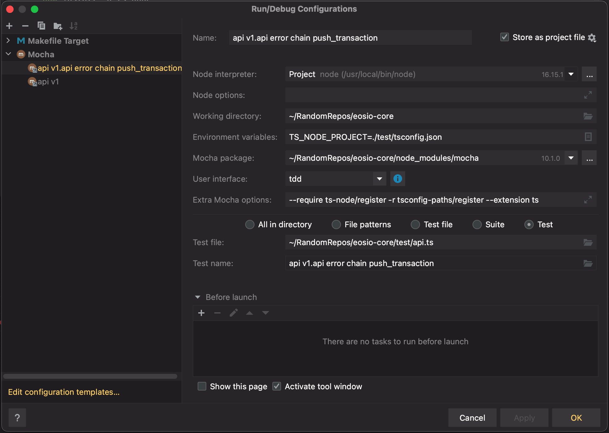

# IDE Configuration for Debugging

## General Steps

Make sure you have ts-node installed. This allows you to debug files from source instead of having to pre-compile everything to JavaScript. Mocha is currently setup to test directly from typescript files.
```shell
npm install -g ts-node
```

## Notes

At a high level get node and Mocha to run typescript files. After that debugging is easy. 

### Make Commands 
The project contains a [Makefile](../Makefile). To see the commands issues by make you can use the `dry-run` flag. You can safely run this at anytime, and it is useful to verify the correct configuration.
```shell
make -n test
```

### Mocha Commands
[Mocha Command Line Reference](https://mochajs.org/#command-line-usage)

## Webstorm (IntelliJ)

In the main navigation click `Run` followed by `Edit Configurations`
- Set *Environment Variables* `TS_NODE_PROJECT=./test/tsconfig.json`
- Set *User Interface* to `tdd`
- Set *Mocha Options* to `--require ts-node/register -r tsconfig-paths/register --extension ts`

In the top Right Corner, select the checkbox `Store as Project File`. To save configurations. 



## Visual Studio

### <font color="red">Need help updating and verifying this section.</font> 

Configuration for VS is stored in `.vscode/launch.json`, and Mocha args are stored in the *args[]* array. The tsconfig is set with an environment variable. This [StackOverflow answer suggests](https://stackoverflow.com/questions/63715484/unable-to-compile-typescript-using-mocha-and-visual-studio-code-debugger) the following.
```
"env": {
    "TS_NODE_PROJECT": "${workspaceFolder}/tsconfig.json" // Or whatever path you have
}
```


